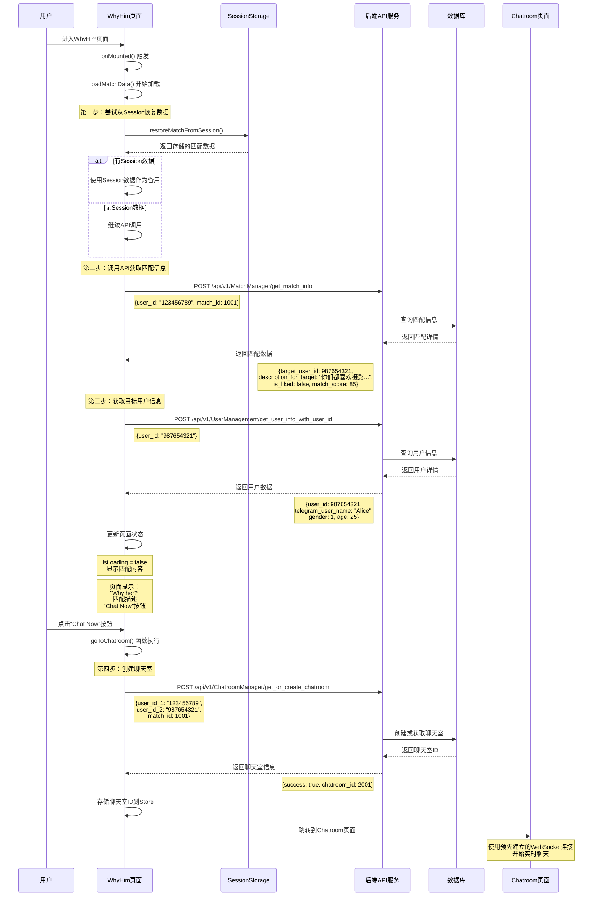
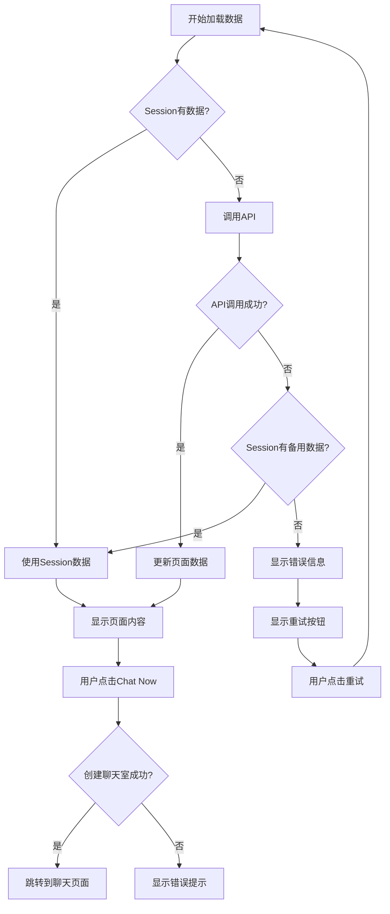

# WhyHim页面流程可视化

## 完整流程图



## 数据流转图

```mermaid
graph TB
    subgraph "前端状态管理"
        A1[userStore.current_match_id]
        A2[userStore.target_user_id]
        A3[userStore.user_id]
        A4[SessionStorage]
    end
    
    subgraph "WhyHim页面组件"
        B1[isLoading: true]
        B2[matchInfo: null]
        B3[targetUserInfo: null]
        B4[error: null]
    end
    
    subgraph "API调用"
        C1[getMatchInfo API]
        C2[getUserInfoWithUserId API]
        C3[getOrCreateChatroom API]
    end
    
    subgraph "后端服务"
        D1[MatchManager]
        D2[UserManagement]
        D3[ChatroomManager]
        D4[(MongoDB)]
    end
    
    subgraph "页面显示"
        E1[动态标题: "Why her/him?"]
        E2[匹配描述文本]
        E3[Chat Now按钮]
    end
    
    A1 --> B1
    A2 --> B1
    A3 --> B1
    A4 --> B1
    
    B1 --> C1
    B1 --> C2
    
    C1 --> D1
    C2 --> D2
    D1 --> D4
    D2 --> D4
    
    D1 --> B2
    D2 --> B3
    
    B2 --> E1
    B2 --> E2
    B3 --> E1
    
    E3 --> C3
    C3 --> D3
    D3 --> D4
```

## 错误处理流程



## 关键代码片段分析

### 1. 数据加载逻辑
```javascript
// 核心数据加载函数
const loadMatchData = async () => {
  try {
    isLoading.value = true
    error.value = null
    
    // 1. Session数据恢复（备用方案）
    const hasSessionData = userStore.restoreMatchFromSession()
    
    // 2. API数据获取（主要方案）
    const matchResponse = await APIServices.getMatchInfo({ 
      user_id: current_user_id, 
      match_id: current_match_id 
    })
    
    // 3. 用户信息获取
    const userResponse = await APIServices.getUserInfoWithUserId(target_user_id)
    
  } catch (err) {
    // 4. 错误处理：使用Session数据或显示错误
    if (!hasSessionData) {
      error.value = err.message
    }
  } finally {
    isLoading.value = false
  }
}
```

### 2. 动态内容计算
```javascript
// 根据性别动态显示
const targetGenderPronoun = computed(() => {
  const gender = targetUserInfo.value?.gender || 1
  return gender === 1 ? 'her' : 'him'
})

// 匹配描述（API优先，Session备用）
const matchDescription = computed(() => {
  return matchInfo.value?.description_for_target || userStore.match_description
})
```

### 3. 聊天室创建
```javascript
const goToChatroom = async () => {
  try {
    // 创建聊天室
    const chatroomResponse = await APIServices.getOrCreateChatroom({
      user_id_1: current_user_id,
      user_id_2: current_target_user_id,
      match_id: current_match_id
    })
    
    if (chatroomResponse.success) {
      // 存储聊天室ID
      userStore.setCurrentMatch({
        ...userStore.currentMatch, 
        chatroom_id: chatroomResponse.chatroom_id 
      })
      
      // 跳转到聊天页面
      router.push('/chatroom')
    }
  } catch (error) {
    toast.value?.show('Error connecting to chat', 'error')
  }
}
```

## 总结

WhyHim页面的设计体现了以下特点：

1. **数据驱动**：通过API获取数据，动态渲染页面内容
2. **容错机制**：Session数据作为API失败的备用方案
3. **用户体验**：加载状态、错误处理、重试机制
4. **功能衔接**：为后续聊天功能做好准备
5. **性能优化**：避免不必要的WebSocket连接开销